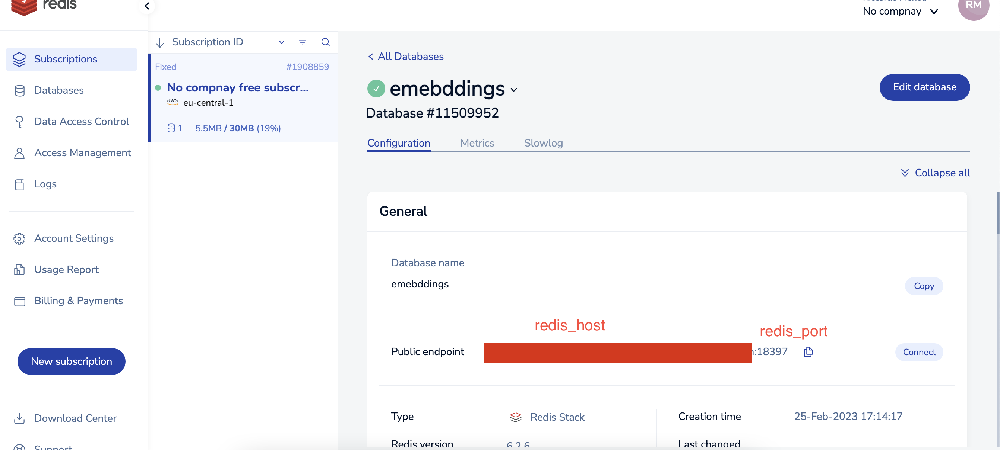
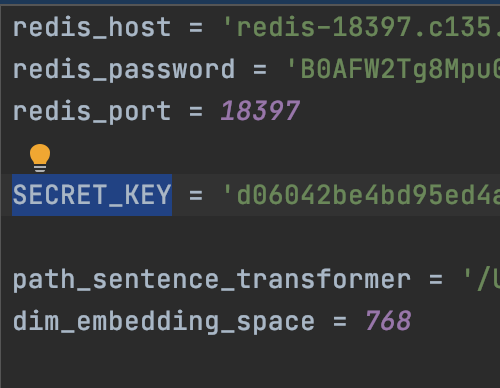

# Embedding exploration API - web app 
This application can be leveraged to explore an embedding space generated by a sentence transformer in a 
fast and efficient way. 

The user can add a set of sentences in an index. 
Then he can perform a search to find the closest element in the index given a given a specific input. The similarity is provided by the cosine similarity in the sentence transformer's embedding space. Thus, it should mimic distances in a semantic space.

This project as been developed to familiarize with the following technologies:
- FastAPI
- Streamlit and its interaction with API calls
- Redis search

The application provides:
- Protected APIs to add adn remove element from exploring space.
- Unprotected APIs to explore the embeddings space.

## Setup

1) Create a Redis account. The free plan is sufficient to cover this use cases: https://redis.com/. Create a database with Redis search. 
2) Generate the file _secrets.toml_ that will collect our secrets and configurations:```bazaar
```
touch secrets.toml
```
3) Copy the redis credentialsin the secret file. You have to take from redis UI the host, the port and the password and copy in _secrets.toml_ under _redis_host_, _redis_port_ and _redis_password_ respectively.
   
   
4) Download a sentence transformer from HuggingFace.
5) Copy the absolute path in of the sentence transformer in _secrets.toml_ under _path_sentence_transformer_. Add to _secrets.toml_ also the embedding dimension _dim_embedding_space_.
6) Generate a DB secret key and copy in _secrets.toml_ under _SECRET_KEY_
Now _secrets.toml_ should be something like
    
7) Install required libraries from _Pip.lock_: 
```
pipenv sync
```
8) Fire up the backend server:
````
pipenv run uvicorn main:app
````
9) Fire up the front server:
```
cd frontend
pipenv run streamlit run streamlit_app.py
```

## Usage

- Classic swagger interface: http://localhost:8000/docs
- Streamlit ad-hoc interface: http://localhost:8501/


